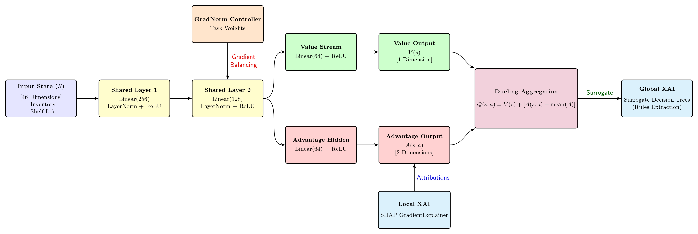
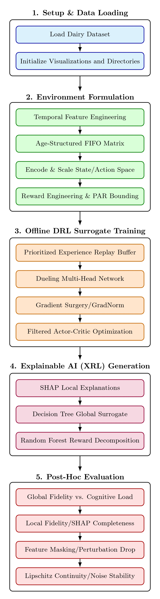

# Quantitative Evaluation of Explainable Dueling Deep Reinforcement Learning in Dairy Supply Chain Optimization

> An Explainable Offline Deep Reinforcement Learning framework for optimizing dynamic pricing and inventory control in dairy supply chains using Dueling Networks, SHAP, and quantitative Explainable AI (XAI) evaluation.

## Overview

Supply chain optimization for perishable products is a challenging task due to uncertain demand, inventory spoilage, and dynamic pricing decisions. While Deep Reinforcement Learning (DRL) has shown promising results in solving such sequential decision-making problems, its lack of interpretability limits adoption in real-world logistics.

This project presents an **Explainable Offline Deep Reinforcement Learning (DRL)** framework that combines advanced reinforcement learning techniques with Explainable AI (XAI) to optimize dairy supply chain operations while providing transparent and trustworthy decision-making.

## Features

- Explainable Offline Deep Reinforcement Learning framework
- Dynamic Pricing Optimization
- Inventory & Reorder Quantity Optimization
- Dueling Multi-Head Deep Neural Network
- Prioritized Experience Replay (PER)
- Preference-As-Reward (PAR) Reward Shaping
- Behavioral Cloning for Offline RL
- GradNorm Gradient Balancing
- SHAP-based Local Explainability
- Decision Tree Global Surrogate Models
- Random Forest Reward Decomposition
- Quantitative Explainability Evaluation

## Problem Statement

Traditional reinforcement learning models achieve high performance but operate as black-box systems, making them unsuitable for safety-critical supply chain applications.

This project aims to:

- Optimize pricing and inventory simultaneously
- Improve offline RL training stability
- Generate interpretable decisions
- Quantitatively validate explanation reliability

## Dataset

**Source:** Country Delight Dairy Sales & Inventory Dataset (Kaggle)

Dataset Characteristics:

- Original Samples: $122,983$
- Processed Samples: $60,035$
- State Features: $46$
- Continuous Actions:
  - Price per Unit
  - Reorder Quantity

Feature engineering includes:

- FIFO Inventory Age Matrix
- Product Aging
- Days to Expiration
- Inventory Aggregation
- Label Encoding
- Feature Standardization

## Model Architecture

### Core Components

- Dueling Multi-Head Network
- Shared Feature Extractor
- State Value Stream
- Action Advantage Stream
- GradNorm Gradient Surgery
- Offline Prioritized Experience Replay
- Preference-As-Reward (PAR)
- Behavioral Cloning

## Explainable AI Techniques

### Local Explainability

- SHAP GradientExplainer

### Global Explainability

- Decision Tree Surrogate Models

### Reward Explainability

- Random Forest Reward Decomposition

## Quantitative XAI Evaluation

The project evaluates explanation quality using objective mathematical metrics instead of subjective visual analysis.

Metrics include:

- Surrogate Fidelity $(R^2)$
- Mean Squared Error
- SHAP Completeness
- ROAR Feature Masking
- Local Lipschitz Stability

## Experimental Results

| Metric                                 | Result   |
| -------------------------------------- | -------- |
| Overall Policy Accuracy                | $82.91%$ |
| Pricing Accuracy                       | $94.50%$ |
| Reordering Accuracy                    | $71.33%$ |
| Pricing Surrogate Fidelity (R²)        | $96.91%$ |
| Top-3 SHAP Feature Masking Reward Drop | $22.24%$ |
| Local Lipschitz Constant               | $3.8509$ |

## Comparison with Existing DRL Models

The proposed Dueling DRL model was compared against:

- PPO
- SAC
- TD3
- Continuous DQN
- Double DQN

The proposed model achieved the highest overall policy accuracy while providing significantly better explainability than conventional DRL approaches.

## Technologies Used

### Programming

- Python

### Deep Learning

- PyTorch

### Machine Learning

- Scikit-learn

### Explainable AI

- SHAP
- Decision Tree

### Data Processing

- NumPy
- Pandas

### Visualization

- Matplotlib

## Key Contributions

- Developed an explainable offline reinforcement learning framework for dairy supply chain optimization.
- Integrated Dueling Networks, PER, PAR, GradNorm, and Behavioral Cloning into a unified architecture.
- Combined SHAP, Decision Tree Surrogates, and Reward Decomposition for interpretable AI.
- Introduced quantitative evaluation metrics for validating explanation fidelity, stability, and selectivity.
- Demonstrated improved policy accuracy while maintaining model transparency.

## Future Work

- Real-time online reinforcement learning
- Multi-agent supply chain optimization
- Causal representation learning
- Neural-backed decision tree explainability
- Large-scale multi-city deployment
